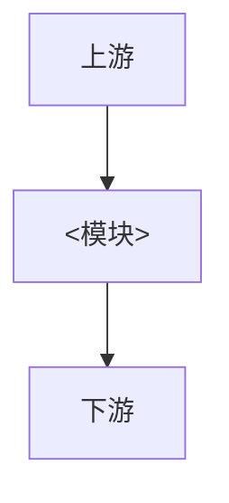

# <模块名>

## 1. 模块概述

<!-- 一句话定位、核心能力、明确不负责的范围 -->

## 2. 架构

<!-- 组件职责与数据/控制方向 -->

## 3. 核心流程

<!-- 初始化或主路径；跨组件用 sequenceDiagram -->

## 4. 接口与配置

<!-- 边界 Topic/API/设备 I/O；配置路径与关键字段；指向 config yaml -->

## 5. 运行与排障

<!-- 构建、启动参数、日志、常见失败 -->

## 6. 测试

见 [TEST_GUIDE.md](TEST_GUIDE.md)。
