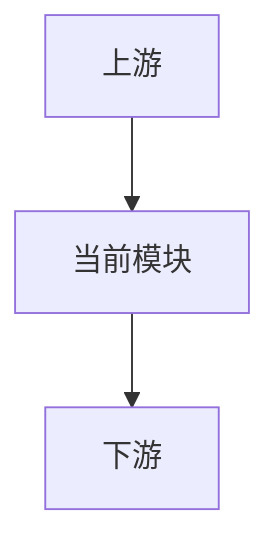
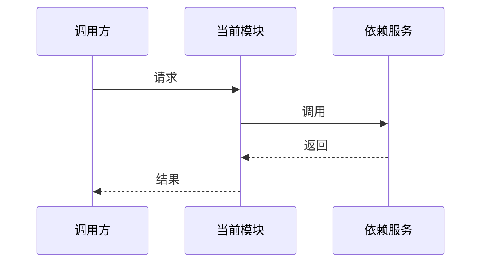

# <模块名称>

## 1. 模块概述

### 1.1 定位

### 1.2 核心功能

### 1.3 模块边界

## 2. 输入、输出与依赖

## 3. 目录结构

## 4. 架构设计

## 5. 核心流程与时序

## 6. 接口与数据模型

## 7. 状态与并发模型

## 8. 配置与运行

## 9. 异常处理与可观测性

## 10. 关键设计决策

## 11. 已知限制与扩展点

## 12. 开发与验证

模块测试方法见 [TEST_GUIDE.md](TEST_GUIDE.md)。
