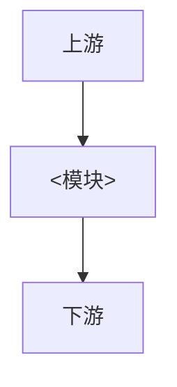

# <模块名>

## 1. 模块概述

[填写提示：一句话说明模块定位、核心能力和明确不负责的范围]

## 2. 架构

[填写提示：说明组件职责与数据、控制方向]

## 3. 核心流程

[填写提示：说明初始化或主路径；跨组件时使用 sequenceDiagram]

## 4. 接口与配置

[填写提示：说明边界 Topic/API/设备 I/O、配置路径与关键字段，并指向 config yaml]

## 5. 运行与排障

[填写提示：说明构建、启动参数、日志和常见失败]

## 6. 测试

见 [TEST_GUIDE.md](TEST_GUIDE.md)。
